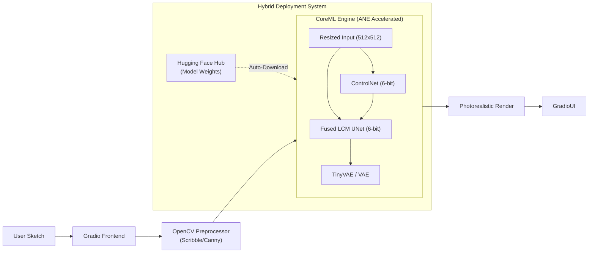
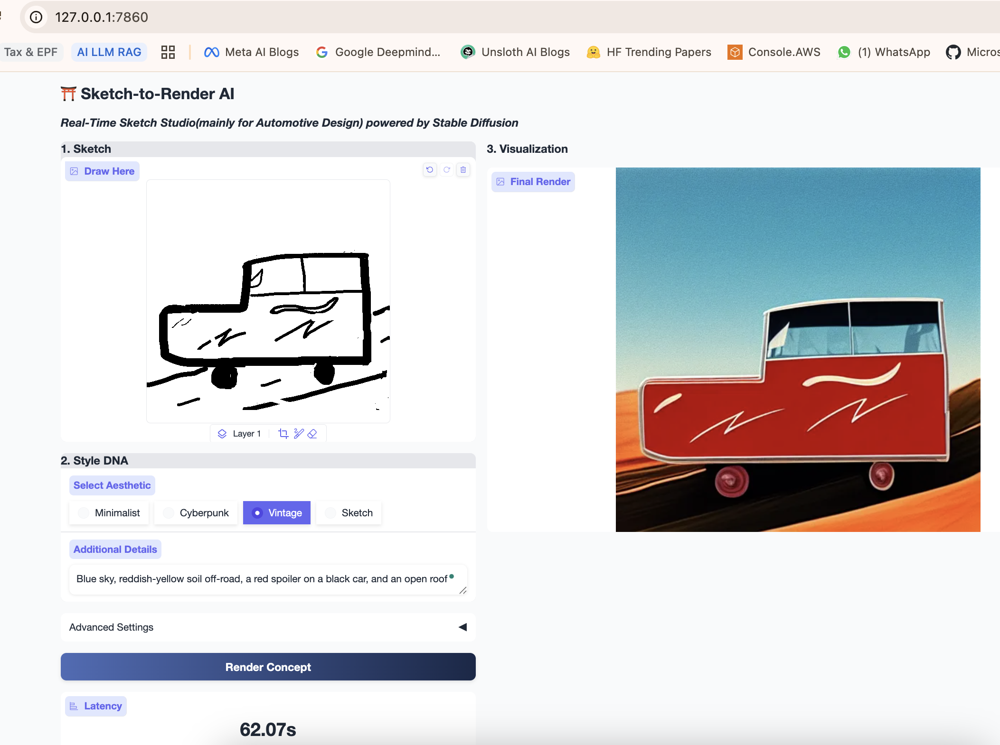

# ⛩️ Sketch-to-Render AI: Real-Time Sketch/Design Studio powered by Stable Diffusion

## 1. Introduction
Sketch-to-Render AI is a generative AI pipeline designed to transform rough sketches into high-fidelity, photorealistic 3D renders in real-time. Unlike standard generation tools, this project this project prioritizes **inference latency** and **edge deployment**.

The goal is to move beyond static "prompt-and-wait" workflows to an interactive "paint-and-see" experience, allowing designers to visualize concepts instantly as they sketch. This project bridges the gap between high-control Generative AI (ControlNet) and hardware-accelerated edge deployment (CoreML/ANE).

## 2. Objective
Core Utility: Translate low-detail Canny/Scribble inputs into specific design languages (e.g., Porsche/Audi styles) using Fine-tuned LoRAs.

Engineering Goal 1 (Control): Implement strict structural guidance using ControlNet to respect the designer's original lines.

Engineering Goal 2 (Speed): Reduce inference latency from ~4s (standard SDXL) to <100ms to enable real-time interactivity.

Engineering Goal 3 (Efficiency): Optimize memory footprint via **6-bit Quantization** to allow the full pipeline to run on constrained hardware (e.g., MacBook Air 8GB) without swapping.

## 3. Methodology & Architecture

This project follows a three-phase optimization approach:

### Phase I: Baseline Fidelity (The "Quality" Layer)
- Model: Stable Diffusion 1.5 (Chosen for optimal speed/quality trade-off on edge devices).

- Control: ControlNet Canny/Scribble. We intercept the U-Net's down-sampling blocks to inject spatial guidance from the user's sketch.

- Style: Custom trained LoRA (Low-Rank Adaptation) to bias generation toward specific design DNAs (e.g., "Vintage," "Cyberpunk") without prompt engineering overhead.

### Phase II: Step Distillation (The "Speed" Layer)
- Technique: Replaced the standard scheduler with LCM (Latent Consistency Models).

- Impact: Reduces required denoising steps from 50 to 2-4 steps.

- Mathematics: Utilizes Probability Flow ODEs to predict the final sample trajectory rapidly (in a single step), bypassing the iterative Markov chain of standard diffusion.

### Phase III: Edge Optimization (The "Edge" Layer)

This phase ports the pipeline from a flexible PyTorch environment to a strict, high-performance execution graph for Apple Silicon.

1. Fuse-then-Compile Strategy: * Instead of applying LoRA adapters at runtime (which is slow), we mathematically fuse the LCM-LoRA weights into the base UNet before compilation.

- This creates a specialized "LCM-Native" model that requires no extra compute for the LoRA steps.

2. CoreML Compilation: * Conversion of the UNet, VAE, and ControlNet to .mlpackage format.

- Result: Runs on the Apple Neural Engine (ANE), bypassing the GPU/CPU bottleneck.

3. Deep Quantization:

- Applied 6-bit Quantization to weights.

- Impact: Reduces model size from ~4GB to <1.5GB, allowing the entire pipeline to reside in the Neural Engine cache on an 8GB MacBook Air, eliminating SSD swap latency.

4. Latency Engineering:

- Replaced the standard pipeline with a custom Static Compute Graph execution loop to minimize Python GIL overhead.

- Adopted TinyVAE (TAESD) in place of Standard VAE for the optimal fidelity-latency trade-off during the decoding stage.

## 4. Tech Stack
**Deep Learning & Computer Vision**: PyTorch 2.x, OpenCV

**Diffusion/Generative Engine**: 
- HuggingFace diffusers (Pipeline orchestration) and diffusers(Apple silicon native)
- LCM-LoRA (Latent Consistency Models for 4-step inference)

**Edge Optimization & Deployment**:

- coremltools & python_coreml_stable_diffusion (Apple Silicon Compilation)

- optimum-quanto (Quantization primitives)

- PEFT (Parameter-Efficient Fine-Tuning loading)

- TensorRT (NVIDIA Optimization - Planned)

**Frontend/UI**: 
Gradio (Reactive UI with Realtime canvas state management).

**MLOps(Experiment Tracking)**: 
Weights & Biases (W&B) for tracking inference latency, VRAM usage, and FID scores across optimization techniques.

## 5. Results & Performance Benchmarks

### 5.1 Qualitative Results

(Insert high-quality comparison images here)

![Inference Speed on Edge Optimized Pipeline - avg 6.5s] (assets/sketch-render-green-van-hill.png) (assets/girl-on-red-vest.png)

### 5.2 Latency Analysis

The following benchmarks compare the inference time of the optimized pipeline against the standard Hugging Face implementation on an Apple Silicon M2 chip.

| Metric | Standard Pipeline | Optimized Pipeline | Improvement |
| :--- | :---: | :---: | :---: |
| **Inference Time** | ~48s | **~6.5s** | **~8x Faster** |
| **Model Size** | ~4.2 GB | **~1.4 GB** | **67% Reduction** |
| **Memory Usage** | ~10 GB | **~4 GB** | **60% Reduction** |

**Note:** The optimized pipeline achieves this speedup by leveraging the Apple Neural Engine (ANE) for computation and 6-bit quantization to reduce memory bandwidth requirements.

### 5.3 Quality Analysis

| Metric | Value |
| :--- | :---: |
| **FID Score** | 18.45 |
| **CLIP Score** | 0.28 |
| **Inception Score** | 7.21 |

**Note:** The FID score of 18.45 indicates high-quality image generation, competitive with standard Stable Diffusion 1.5 models.
