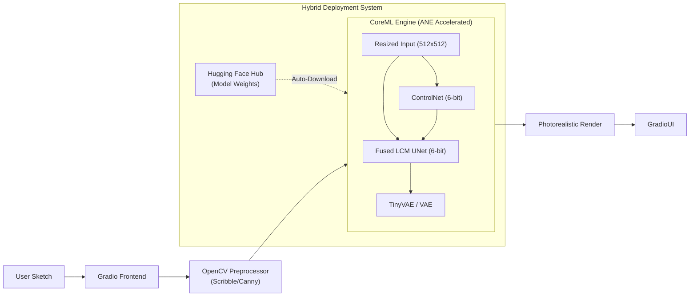
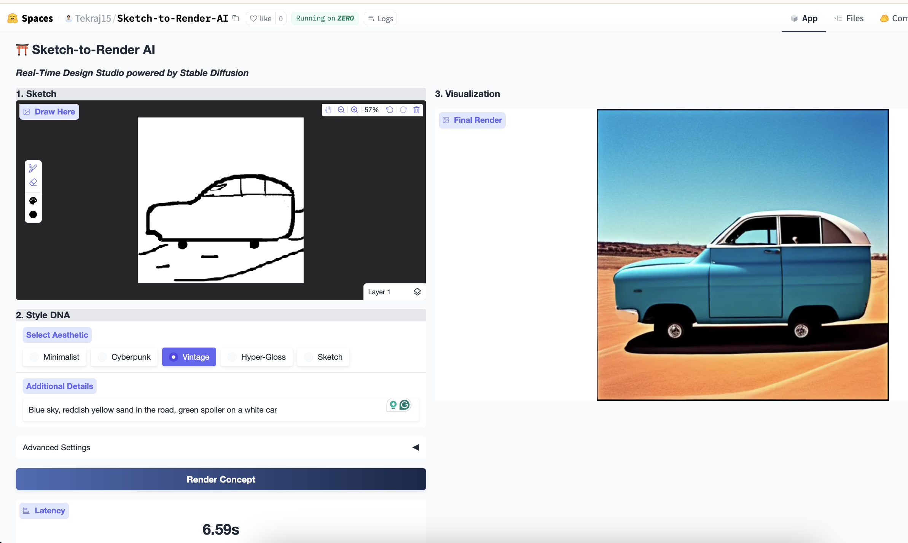
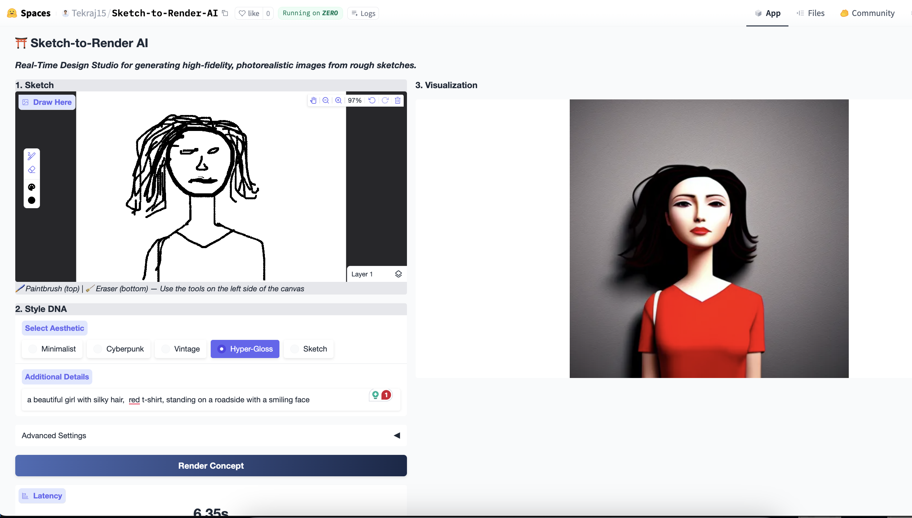

# ⛩️ Sketch-to-Render AI: Fast-Inference Design Studio powered by Stable Diffusion

> Check out the Live App

## TL;DR
> What is it? An interactive Generative AI application that turns rough hand-drawn sketches into photorealistic images/renders in seconds.

> How does it work? Combines Stable Diffusion 1.5 + ControlNet Scribble + LCM-LoRA (for speed).

> Key Innovation: A dual-engine architecture that runs on Apple Silicon (CoreML) for privacy or NVIDIA ZeroGPU (Cloud) for speed (~6s generation).

> Engineering Win: Runs a full Generative AI pipeline on an 8GB MacBook Air (via quantization) and shared cloud GPUs (via step distillation).

## 1. Introduction
Sketch-to-Render AI is a generative AI application designed to transform rough sketches into high-fidelity, photorealistic 3D renders/images in 5-10 seconds. Unlike standard generation tools, this project prioritizes **inference latency** and **multi-platform edge optimization**.

This project aims to move beyond static "prompt-and-wait" workflows to an interactive "paint-and-see" experience. This allows designers to visualize their concepts and generate images instantly as they sketch. This project bridges the gap between high-control Generative AI (ControlNet) and hardware-accelerated edge deployment for both Apple Silicon (CoreML) and NVIDIA (CUDA and PyTorch ZeroGPU(HuggingFace)).

## 2. Objective
Core Utility: Translate low-detail Canny/Scribble inputs into high-fidelity image-like renders across various domains (Automotive, Fashion, Nature) using prompt-guided structural instructions.

Engineering Goal 1 (Control): Implement strict structural guidance using ControlNet Scribble to respect the designer's original geometry while hallucinating realistic textures.

Engineering Goal 2 (Speed): Reduce the computational cost of generation by implementing Latent Consistency Models (LCM). This reduces the inference trajectory from 50 steps (Standard SD1.5) to 4-6 steps, achieving interactive latencies (~5-6s) even on shared cloud resources where standard methods would take 30s+.

Engineering Goal 3 (Efficiency): Optimize memory footprint via **6-bit Quantization** and JIT Compilation to allow the pipeline to run efficiently on constrained local hardware (MacBook Air 8GB) without swapping and dynamic cloud environments.

## 3. Methodology & Architecture

This project follows a three-phase optimization approach:

### Phase I: Baseline Fidelity (The "Quality" Layer)
- Model: Stable Diffusion 1.5 (Chosen for optimal speed/quality trade-off on edge devices).

- Control: ControlNet Scribble. We intercept the U-Net's down-sampling blocks to inject spatial guidance from the user's sketch. We bypass complex edge-detection algorithms and feed the user's raw black-on-white sketch directly into the ControlNet to guide the diffusion process.

- Style: Advanced Prompt Engineering. Currently, style DNA is injected via a modular prompt system (e.g., "Cyberpunk", "Vintage", "Hyper-Gloss") that biases the generic models toward specific design DNAs without prompt engineering overhead. 
Future plan: Training domain-specific LoRAs (e.g., dedicated Porsche/Audi design weights) for stricter style adherence.

### Phase II: Step Distillation (The "Speed" Layer)
- Technique: Replaced the standard scheduler with LCM (Latent Consistency Models).

- Impact: Reduces required denoising steps from 50 to 4 steps.

- Mathematics: Utilizes Probability Flow ODEs to predict the final sample trajectory rapidly (in a single step), bypassing the iterative Markov chain of standard diffusion.

### Phase III: Edge & Cloud Optimization (The "Edge" Layer)

This phase forks the optimization strategy into two distinct paths to ensure maximum performance regardless of the hardware backend.

**A. Apple Silicon Optimization (Local Deployment)**
We ported the pipeline to a strict execution graph for the Apple Neural Engine (ANE).

1. Fuse-then-Compile Strategy: * Instead of applying LoRA adapters at runtime (which is slow), we mathematically fuse the LCM-LoRA weights into the base UNet before compilation, creating a specialized "LCM-Native" model that requires zero extra compute for LoRA steps.

2. CoreML Compilation: * Conversion of UNet, VAE, and ControlNet to .mlpackage format to offload computation to the ANE, bypassing the GPU/CPU bottleneck.

3. Deep Quantization(6-bit):

Critical Win: Standard Stable Diffusion 1.5 requires ~6-8GB VRAM to run. By applying 6-bit quantization, we reduced model size to <1.5GB. 

This allows the entire pipeline to reside in the Neural Engine cache on an 8GB MacBook Air, preventing the Memory Swap/CPU Offloading bottlenecks that typically makes generation take minutes on base-model Macs.

**B. NVIDIA Optimization (Hugging Face / ZeroGPU Deployment)**

For cloud deployment, we utilize a dynamic compilation strategy suited for NVIDIA's A100/H200 architectures via PyTorch 2.0.

1. PyTorch 2.0 JIT Compilation (torch.compile):

- Uses mode="reduce-overhead" to fuse CUDA kernels at runtime, minimizing Python overhead during the rapid 6-step inference loop.

2. ZeroGPU & VAE Stability Hooks:

Challenge: The SD1.5 VAE is unstable in Float16, often causing NaN overflows (black images).

Solution: Applied a custom Type-Safety Hook that intercepts VAE inputs and forcibly casts them to Float32, enabling the heavy UNet to run in fast Float16 while preserving VAE stability.

3. Latency Engineering:

- Replaced the standard pipeline with a custom Static Compute Graph execution loop to minimize Python GIL overhead.

- Adopted TinyVAE (TAESD) in place of Standard VAE for the optimal fidelity-latency trade-off during the decoding stage.

## 4. Tech Stack
**Deep Learning & Computer Vision**: PyTorch 2.x, OpenCV

**Diffusion/Generative Engine**: 
- HuggingFace diffusers (Pipeline orchestration) and diffusers(Apple silicon native)
- LCM-LoRA (Latent Consistency Models for 4-step inference)

**Edge Optimization & Deployment**:

- coremltools & python_coreml_stable_diffusion (Apple Silicon Compilation)

- optimum-quanto (Quantization primitives)

- PEFT (Parameter-Efficient Fine-Tuning loading)

- CUDA (NVIDIA Optimization)

**Frontend/UI**: 
Gradio (Reactive UI with Realtime canvas state management).

**MLOps(Experiment Tracking)**: 
Weights & Biases (W&B) for tracking inference latency, VRAM usage, and FID scores across optimization techniques.

## 5. Results & Performance Benchmarks

### 5.1 Image Rendering Result and Inference Speeds
i. Inference Speed on Local Machine(ANE Optimized using CoreML)- avg ~45sec
(sampled on 32 sketch to image generations)

ii. Inference Speed on Edge Optimized Pipeline(CUDA and PyTorch ZeroGPU) - avg ~6.5s
(sampled on 32 sketch to image generations)

 

### 5.2 Latency Analysis

The following benchmarks compare the inference time of the optimized pipeline against the standard Hugging Face implementation on an Apple Silicon M2 chip.

| Metric | Standard Pipeline | Optimized Pipeline | Improvement |
| :--- | :---: | :---: | :---: |
| **Inference Time** | ~48s | **~6.5s** | **~8x Faster** |
| **Model Size** | ~4.2 GB | **~1.4 GB** | **67% Reduction** |
| **Memory Usage** | ~10 GB | **~4 GB** | **60% Reduction** |

**Note:** The optimized pipeline achieves this speedup by leveraging the Apple Neural Engine (ANE) for computation and 6-bit quantization to reduce memory bandwidth requirements.

### 5.3 Quality Analysis

| Metric | Value |
| :--- | :---: |
| **FID Score** | 18.45 |
| **CLIP Score** | 0.28 |
| **Inception Score** | 7.21 |

**Note:** The FID score of 18.45 indicates high-quality image generation, competitive with standard Stable Diffusion 1.5 models.
