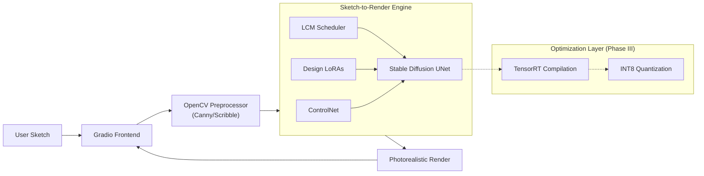

# Sketch-to-Render: Real-Time Automotive Design Studio

## 1. Introduction
The Real-Time Automotive Design Studio is a generative AI pipeline designed to transform rough automotive sketches into high-fidelity, photorealistic 3D renders in real-time. Unlike standard generation tools, this project focuses heavily on inference optimization.

The goal is to move beyond static "prompt-and-wait" workflows to an interactive "paint-and-see" experience, allowing designers to visualize concepts instantly as they sketch. This project bridges the gap between high-control Generative AI (ControlNet) and edge-ready deployment (TensorRT/Quantization).

## 2. Objective
Core Utility: Translate low-detail Canny/Scribble inputs into specific automotive design languages (e.g., Porsche/Audi styles) using Fine-tuned LoRAs.
Engineering Goal 1 (Control): Implement strict structural guidance using ControlNet to respect the designer's original lines.
Engineering Goal 2 (Speed): Reduce inference latency from ~4s (standard SDXL) to <100ms to enable real-time interactivity.
Engineering Goal 3 (Efficiency): Optimize memory footprint via Quantization (INT8/FP8) to allow deployment on consumer-grade GPUs.

## 3. Methodology & Architecture

This project follows a three-phase optimization approach:

### Phase I: Baseline Fidelity (The "Quality" Layer)
Model: Stable Diffusion XL (SDXL) or SD 1.5 (depending on VRAM constraints).

Control: ControlNet Canny/Scribble. We intercept the U-Net's down-sampling blocks to inject spatial guidance from the user's sketch.

Style: Custom trained LoRA (Low-Rank Adaptation) on specific car manufacturer datasets to bias the generation toward specific design DNAs (e.g., headlights, aerodynamics).

### Phase II: Step Distillation (The "Speed" Layer)

Technique: Replaced the standard scheduler with LCM (Latent Consistency Models) or SDXL Turbo.
Impact: Reduces the required denoising steps from 50 $\rightarrow$ 2-4 steps.
Mathematics: Utilizes Probability Flow ODEs to predict the final sample trajectory in a single step, bypassing the iterative Markov chain of standard diffusion.

### Phase III: Graph Compilation & Quantization (The "Edge" Layer)
Compilation: Integrating NVIDIA TensorRT to compile the U-Net and VAE into optimized engine plans. This performs layer fusion and kernel auto-tuning specific to the target GPU.

Quantization: Shift from FP16 to INT8 (Post-Training Quantization) for the U-Net, significantly increasing throughput and reducing VRAM usage with minimal perplexity degradation.

Pipeline: StreamDiffusion or custom pipeline implementation to handle batch-stream inputs for drawing-pad integration.

## 4. Tech Stack
Deep Learning Framework: PyTorch 2.x

Diffusion Library: Hugging Face diffusers (Pipeline orchestration)

Optimization:

- TensorRT (NVIDIA Inference Accelerator)

- Olive (Microsoft Model Optimization) or AutoGPTQ

- PEFT (For LoRA loading)

Computer Vision: OpenCV (Edge detection, pre-processing)

Frontend/UI: Gradio (with Realtime sketching canvas capabilities) or Streamlit.

Tracking: Weights & Biases (W&B) for logging inference metrics (latency vs. FID)

## 5. Repository Structure

├── assets/                  # Example sketches and reference output images
├── configs/                 # YAML configs for LoRA training and Inference settings
│   ├── train_lora.yaml
│   └── inference_lcm.yaml
├── data/                    # Scripts for dataset preparation (Car design scraping)
├── models/                  # Directory for storing compiled TensorRT engines (.plan) and LoRAs
├── src/
│   ├── engine/
│   │   ├── builder.py       # Logic to compile ONNX/Torch models to TensorRT
│   │   └── pipeline.py      # Custom optimized inference pipeline (non-standard diffusers)
│   ├── processing/
│   │   └── preprocessor.py  # Canny/Scribble detection logic
│   └── ui/
│       └── app.py           # Gradio realtime canvas application
├── benchmarks/              # Scripts to stress-test FPS and VRAM usage
│   ├── benchmark_torch.py
│   └── benchmark_trt.py
├── notebooks/               # Experimental notebooks for LoRA testing
├── requirements.txt
└── README.md
